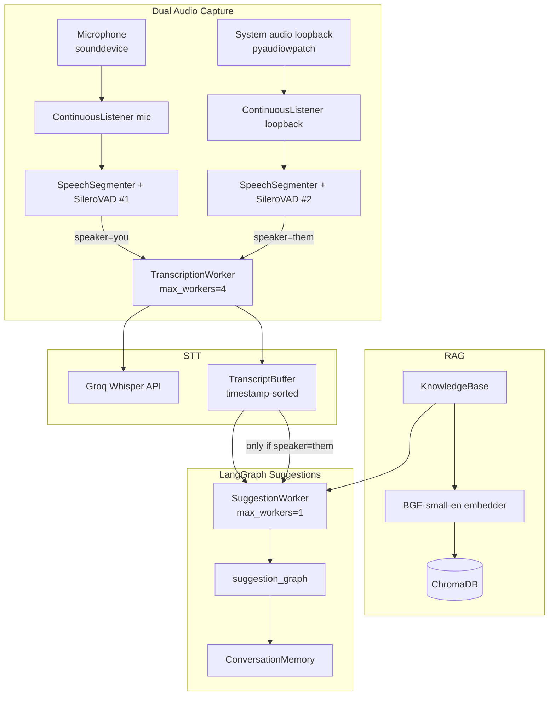
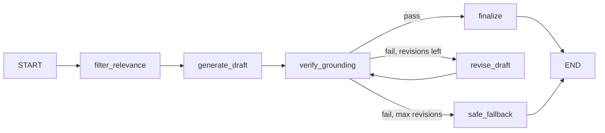

# Meeting Responder (Meeting Copilot)

Real-time meeting assistant for Windows that captures **your microphone** and **system audio (call participants)** simultaneously, detects speech segments with local Silero VAD, transcribes via Groq Whisper, retrieves facts from your own documents (RAG), and generates **grounded, verified** reply suggestions through a **LangGraph** pipeline you can say out loud during a live call.

> **Maintaining this document:** Update this README whenever you add features, change defaults, swap models, or modify the pipeline. Keep configuration tables, phase status, and tuning values in sync with the code.

**Last updated:** 2026-06-29  
**Current status:** Production PyQt6 desktop app with dual-stream capture (`[You]` / `[Them]`), LangGraph anti-hallucination suggestions, glass UI, system tray, setup wizard, settings dialog, and Windows EXE packaging.

---

## Table of contents

1. [What it does](#what-it-does)
2. [Architecture & data flow](#architecture--data-flow)
3. [Dual-stream audio capture](#dual-stream-audio-capture)
4. [LangGraph suggestion pipeline](#langgraph-suggestion-pipeline)
5. [Development phases](#development-phases)
6. [Project structure](#project-structure)
7. [Requirements & setup](#requirements--setup)
8. [Configuration (`.env`)](#configuration-env)
9. [Persisted UI settings (QSettings)](#persisted-ui-settings-qsettings)
10. [Models & local assets](#models--local-assets)
11. [External services](#external-services)
12. [Tuning parameters reference](#tuning-parameters-reference)
13. [Knowledge base (RAG)](#knowledge-base-rag)
14. [Prompt & speaker-aware behavior](#prompt--speaker-aware-behavior)
15. [Desktop UI](#desktop-ui)
16. [Windows EXE packaging](#windows-exe-packaging)
17. [Dev scripts](#dev-scripts)
18. [Testing](#testing)
19. [Observed latency (reference)](#observed-latency-reference)
20. [Known issues & limitations](#known-issues--limitations)
21. [Roadmap](#roadmap)
22. [Dependency pins](#dependency-pins)

---

## What it does

| Capability | Description |
|------------|-------------|
| **Dual live capture** | Microphone (`[You]`) + WASAPI loopback / system audio (`[Them]`) run in parallel |
| **Speaker tagging** | Every transcript line tagged `you` or `them`; suggestions trigger only on `[Them]` |
| **Chronological merge** | Transcript buffer sorted by segment close time, not STT arrival order |
| **Voice activity detection** | Silero VAD (ONNX, local) — **separate VAD state per stream** |
| **Speech-to-text** | Groq Whisper (`whisper-large-v3-turbo`), shared worker pool (`max_workers=4`) |
| **Document RAG** | Ingest PDF/DOCX/TXT → chunk → embed → ChromaDB; query at suggestion time |
| **LangGraph suggestions** | Retrieve → relevance filter → draft → verify → revise → safe fallback |
| **Conversation memory** | Rolling session summary updated after each approved suggestion |
| **Glass desktop UI** | Frameless PyQt6 window, transcript + suggestion panels, system tray |
| **Windows packaging** | PyInstaller one-folder EXE + zip distributable |
| **Debug artifacts** | WAV segments saved to `data/debug_segments/`; optional retrieval score panel |

**Production entry points:**

| Entry | Purpose |
|-------|---------|
| `python -m app.main` | Full desktop app (recommended) |
| `scripts/dev_assistant.py` | Terminal full pipeline (reference; single-stream mic only) |

**Intentionally unchanged baselines** (do not modify when adding features):

- `scripts/dev_listen.py` — Phase 1 audio only
- `scripts/dev_transcribe.py` — Phase 1 + 2 STT only

---

## Architecture & data flow

### End-to-end pipeline (desktop app)



### Threading model

| Component | Pool / threads | Workers | Why |
|-----------|----------------|---------|-----|
| Mic capture consumer | `threading.Thread` | 1 | Independent VAD/segmenter queue loop |
| Loopback capture consumer | `threading.Thread` | 1 | Same pattern, separate Silero state |
| Session coordinator | `threading.Thread` | 1 | Starts streams, waits on stop event, shuts down |
| `TranscriptionWorker` | `ThreadPoolExecutor` | **4** | Two live streams can finalize segments simultaneously |
| `SuggestionWorker` | `ThreadPoolExecutor` | **1** | Sequential suggestions — clean one-at-a-time UI |
| Debug WAV save | `threading.Thread` | daemon | Off critical STT path |
| Qt signal bridge | Main thread | — | `PipelineController` emits to `MainWindow` |

### Segment lifecycle (timing)

1. **Speech starts** — VAD probability ≥ `0.5` AND peak level ≥ `0.04`
2. **Speech continues** — while speaking, VAD ≥ `0.35` (hysteresis) and level ≥ `0.04`
3. **Pause** — after **900 ms** silence (`~29 chunks × 32 ms`), segment closes
4. **Finalize** — trailing silence trimmed; min duration **250 ms** or segment discarded
5. **STT** — in-memory WAV encode (~0 ms) + Groq API (~0.3–0.6 s); debug WAV saved in parallel
6. **Suggestion** (LangGraph) — relevance filter → draft → verify → (optional revise) → stream verified text

### Global segment indices

Each stream has its own local segment counter for debug WAV filenames, but `PipelineController` assigns a **global monotonic `segment_index`** when submitting to STT — prevents UI/suggestion collisions between mic and loopback streams.

---

## Dual-stream audio capture

### Overview

The app runs **two fully independent capture pipelines** simultaneously:

| Stream | Source | Backend | Tagged as | Triggers suggestion? |
|--------|--------|---------|-----------|---------------------|
| **Mic** | Default input (or Advanced mic override) | `sounddevice` | `[You]` | No |
| **Call / system** | Default output loopback (or Advanced loopback override) | `pyaudiowpatch` | `[Them]` | Yes |

Each stream owns:

- Its own `SileroVAD` instance with independent `reset_state()`
- Its own `SpeechSegmenter` (separate level/threshold tuning possible)
- Its own `ContinuousListener` and consumer thread

Both streams share:

- One `TranscriptionWorker`
- One `TranscriptBuffer`
- One `KnowledgeBase`

### Why two backends?

`sounddevice` 0.4.6–0.5.5 does not expose WASAPI loopback through bundled PortAudio. On Windows, **loopback capture uses `pyaudiowpatch`** while microphone capture stays on **`sounddevice`**.

Loopback device resolution: `device_manager.resolve_loopback_capture_index()` matches the default (or selected) output device name to a pyaudiowpatch loopback input index.

### Mic-only testing mode

UI checkbox: **"Mic only (testing mode)"**

| Setting | Behavior |
|---------|----------|
| **Enabled** | Only mic pipeline runs; all entries tagged `[Them]`; suggestions fire on mic speech — identical to early single-stream testing |
| **Disabled** (default) | Both mic + loopback run; mic → `[You]`, loopback → `[Them]` |

Persisted in QSettings: `audio/mic_only_testing`.

### Advanced device picker

**Advanced…** toggle exposes a combo of all mic (sounddevice) and loopback (pyaudiowpatch) endpoints. Selecting a device overrides **only that stream type**:

- Mic device selected → overrides mic index; loopback stays default
- Loopback device selected → overrides loopback index; mic stays default

### Resampling

Both listeners resample device-native audio to **16 kHz, 512-sample VAD chunks**:

- Prefers **48000 Hz** native (clean 3:1 integer resample)
- Falls back to device default or 44100 Hz

---

## LangGraph suggestion pipeline

When `USE_LANGGRAPH_SUGGESTIONS=true` (default), suggestions go through a multi-step **LangGraph** workflow instead of a single streaming LLM call.

### Graph flow



### Node descriptions

| Node | Purpose |
|------|---------|
| **filter_relevance** | LLM (JSON) selects which RAG candidate snippets actually relate to the latest `[Them]` message — ignores off-topic docs (e.g. SLA during weather chat) |
| **generate_draft** | Draft 2–3 sentence reply using transcript + conversation summary + filtered docs |
| **verify_grounding** | LLM (JSON) checks every factual claim in draft is supported by transcript or docs only |
| **revise_draft** | One rewrite pass removing unsupported claims (controlled by `SUGGESTION_MAX_REVISIONS`) |
| **finalize** | Approve draft as final suggestion |
| **safe_fallback** | If still ungrounded: *"I'd want to double-check the specifics before answering that — let me follow up on that point."* |

### Conversation memory

`ConversationMemory` maintains a **rolling session summary** (≤120 words):

- Reset when listening session starts
- Updated after each approved suggestion via a dedicated LLM call
- Injected into every graph run as long-term context alongside the last 8 transcript lines
- Strict rule: summary may only contain facts explicitly stated in input — no inference

### UI streaming behavior

LangGraph runs **fully before display** (draft + verify complete first). The verified final text is then emitted to the UI in small pseudo-stream chunks (~12 chars) so the suggestion panel retains a streaming feel without showing unverified tokens.

**Tradeoff:** Higher time-to-first-token vs. single-pass streaming, in exchange for grounding verification.

### Legacy path

Set `USE_LANGGRAPH_SUGGESTIONS=false` in `.env` to revert to direct Groq streaming via `generate_suggestion_streaming()` + `prompt_builder.build_messages()`.

### Key files

| File | Role |
|------|------|
| `app/core/llm/suggestion_graph.py` | LangGraph `StateGraph` definition + `run_suggestion_graph()` |
| `app/core/llm/conversation_memory.py` | Session summary store + update |
| `app/core/llm/llm_utils.py` | Groq chat completion + JSON parsing helpers |
| `app/core/llm/suggestion_worker.py` | Orchestrates RAG query, graph invoke, memory update, UI callbacks |
| `app/core/llm/prompt_builder.py` | Transcript formatting, document context, legacy message builder |

---

## Development phases

| Phase | Scope | Status | Entry point |
|-------|--------|--------|-------------|
| **0** | Scaffolding, deps, paths, tests | ✅ Done | `tests/run_all_tests.py` |
| **1** | Audio capture + Silero VAD segmentation | ✅ Done | `scripts/dev_listen.py` |
| **2** | Async Groq STT + latency tuning | ✅ Done | `scripts/dev_transcribe.py` |
| **3** | RAG ingest + vector query | ✅ Done | `scripts/dev_ingest.py`, `scripts/dev_query.py` |
| **4** | Streaming LLM suggestions + relevance filter | ✅ Done | `scripts/dev_assistant.py` |
| **5** | PyQt6 desktop UI (`PipelineController` + `MainWindow`) | ✅ Done | `python -m app.main` |
| **5.5A** | Glass UI restyle — frameless window, custom title bar, glass panels | ✅ Done | `python -m app.main` |
| **5.5B** | System audio loopback capture (Windows WASAPI) | ✅ Done | `python -m app.main` |
| **5.5C** | Dual-stream capture + `[You]`/`[Them]` speaker tagging | ✅ Done | `python -m app.main` |
| **6** | Setup wizard (first launch) | ✅ Done | Auto on first run |
| **7** | System tray + settings dialog | ✅ Done | Tray icon + Settings button |
| **8** | Windows EXE packaging (PyInstaller) | ✅ Done | `build/build_windows.bat` |
| **9** | LangGraph grounded suggestions + conversation memory | ✅ Done | Default in app |

---

## Project structure

```
meeting_responder/
├── app/
│   ├── main.py                          # PyQt6 launcher, setup gate, tray, --smoke-test
│   ├── assets/models/
│   │   └── silero_vad.onnx              # Silero VAD (~2.2 MB — wizard downloads)
│   ├── core/
│   │   ├── groq_client.py               # Singleton Groq SDK client
│   │   ├── pipeline_controller.py       # Dual-stream capture + Qt signal bridge
│   │   ├── audio/
│   │   │   ├── capture.py               # Simple sd.rec test helper
│   │   │   ├── device_manager.py        # Mic/loopback listing, resolution, advanced picker
│   │   │   ├── output_detector.py       # Default output device info (pycaw)
│   │   │   ├── listener.py              # ContinuousListener + SpeechSegmenter
│   │   │   └── vad.py                   # SileroVAD ONNX wrapper
│   │   ├── stt/
│   │   │   ├── groq_stt.py              # STT + warm_up + in-memory WAV encode
│   │   │   ├── transcription_worker.py  # Async STT pool (max_workers=4, speaker tag)
│   │   │   ├── transcript_buffer.py     # TranscriptEntry + speaker + timestamp sort
│   │   │   └── transcript_quality.py    # is_meaningful_transcript filter
│   │   ├── rag/
│   │   │   ├── chunking.py              # Sentence-aware chunking
│   │   │   ├── embedder.py              # fastembed BGE-small-en
│   │   │   ├── ingestion.py             # PDF/DOCX parsers
│   │   │   ├── knowledge_base.py        # Ingest + query API
│   │   │   ├── vectorstore.py           # ChromaDB persistent store
│   │   │   └── chroma_telemetry.py      # No-op telemetry (silences Posthog noise)
│   │   └── llm/
│   │       ├── groq_llm.py              # ask_llm + streaming completions
│   │       ├── llm_utils.py              # chat_complete + JSON parse helpers
│   │       ├── prompt_builder.py        # Speaker-aware transcript formatting
│   │       ├── conversation_memory.py   # Rolling session summary
│   │       ├── suggestion_graph.py      # LangGraph anti-hallucination pipeline
│   │       └── suggestion_worker.py     # RAG + graph + memory job runner
│   ├── ui/
│   │   ├── main_window.py               # Glass UI, dual capture controls, HTML transcript
│   │   ├── setup_wizard.py              # First-launch setup dialog
│   │   ├── system_tray.py               # Tray icon + context menu
│   │   ├── window_utils.py              # Edge resize margin constant
│   │   ├── dialogs/settings_dialog.py   # API key, mic, knowledge base
│   │   ├── widgets/
│   │   │   ├── custom_title_bar.py      # Drag, minimize, maximize, close
│   │   │   ├── glass_panel.py           # Transcript / suggestion sub-panels
│   │   │   ├── status_pill.py           # Listening status indicator
│   │   │   └── fade_entry.py            # Legacy fade label (unused in transcript)
│   │   └── styles/dark_theme.qss        # Glass dark theme stylesheet
│   └── utils/
│       ├── config.py                    # pydantic-settings / .env
│       ├── paths.py                     # Dev + frozen PyInstaller paths
│       ├── app_settings.py              # QSettings persistence (mic, testing mode)
│       ├── setup.py                     # First-launch checks, VAD download, key validation
│       ├── std_streams.py               # Fix None stdout/stderr in windowed EXE
│       └── frozen_smoke_test.py         # --smoke-test for packaged build validation
├── build/
│   ├── meeting_responder.spec           # PyInstaller spec (one-folder)
│   └── build_windows.bat                # Clean, build, zip distributable
├── data/
│   ├── knowledge_base/                  # ChromaDB persistence (auto-created)
│   ├── debug_segments/                  # Saved WAV segments (auto-created)
│   ├── test_acme_sla.txt                # Sample SLA doc for testing
│   └── test_office_locations.txt        # Sample office doc (unrelated topic)
├── dist/
│   └── MeetingResponder/                # Built EXE output (after build)
├── scripts/
│   ├── dev_listen.py                    # Phase 1 only (baseline — do not modify)
│   ├── dev_transcribe.py                  # Phase 1 + 2 (baseline — do not modify)
│   ├── dev_ingest.py                    # Phase 3 ingest
│   ├── dev_query.py                     # Phase 3 query CLI
│   └── dev_assistant.py                 # Phase 1–4 full pipeline (terminal reference)
├── tests/                               # Dependency & smoke tests
├── .env                                 # Secrets & model names (not committed)
├── requirements.txt
├── requirements-dev.txt                 # PyInstaller for builds
└── README.md                            # ← this file
```

---

## Requirements & setup

### Runtime

| Item | Value |
|------|--------|
| **Python** | **3.11** (venv uses 3.11.x). Do **not** use system Python 3.14 — several deps lack wheels. |
| **OS tested** | **Windows 10/11** (loopback requires Windows + pyaudiowpatch) |
| **Mic** | Any PortAudio input device; USB headset mic recommended over "Sound Mapper" |
| **Speakers/headphones** | Required for dual-stream mode — loopback captures default output device |

### Install

```powershell
cd meeting_responder
python -m venv venv
venv\Scripts\python.exe -m pip install -r requirements.txt
venv\Scripts\python.exe -m app.main
```

On first launch, the **setup wizard** runs automatically if any of these are missing:

- `GROQ_API_KEY` in `.env`
- `app/assets/models/silero_vad.onnx`
- `data/.setup_complete` marker (written after wizard finishes)

The wizard will:

1. Validate and save your Groq API key
2. Download Silero VAD (~2 MB)
3. Pre-download the fastembed model (~130 MB)

**Windowed EXE note:** Setup wizard embedder step previously crashed with `'NoneType' object has no attribute 'write'` because `console=False` sets stdout/stderr to `None`. Fixed via `app/utils/std_streams.py` (`ensure_std_streams()`) called at startup and during embedder warm-up, plus `HF_HUB_DISABLE_PROGRESS_BARS=1` and `TQDM_DISABLE=1`.

Terminal-only dev scripts still require manual setup or a completed wizard run first.

### Verify environment

```powershell
venv\Scripts\python.exe tests\run_all_tests.py
```

Expect **8 passed** (Groq tests skip if `GROQ_API_KEY` is empty).

---

## Configuration (`.env`)

Create `meeting_responder/.env`:

```env
GROQ_API_KEY=your_groq_api_key_here
GROQ_STT_MODEL=whisper-large-v3-turbo
GROQ_LLM_MODEL=llama-3.3-70b-versatile

# LangGraph suggestion pipeline (defaults shown)
USE_LANGGRAPH_SUGGESTIONS=true
SUGGESTION_MAX_REVISIONS=1
```

| Variable | Default (in code) | Purpose |
|----------|-------------------|---------|
| `GROQ_API_KEY` | `""` (required) | Groq API authentication |
| `GROQ_STT_MODEL` | `whisper-large-v3-turbo` | Whisper transcription model |
| `GROQ_LLM_MODEL` | `llama-3.3-70b-versatile` | Chat completion for suggestions, verification, memory |
| `USE_LANGGRAPH_SUGGESTIONS` | `true` | Enable LangGraph pipeline; `false` = legacy single-pass streaming |
| `SUGGESTION_MAX_REVISIONS` | `1` | Max revise loops after failed grounding verification |

Loaded via `pydantic-settings` from `app/utils/config.py` → `settings`.

**Never commit `.env` or API keys.**

---

## Persisted UI settings (QSettings)

Stored under organization `MeetingResponder`, application `MeetingCopilot`:

| Key | Type | Purpose |
|-----|------|---------|
| `audio/device_index` | int | Last selected Advanced device index |
| `audio/source_mode` | string | Legacy key (`loopback` / `microphone` / `advanced`) |
| `audio/advanced_backend` | string | `sounddevice` or `pyaudiowpatch` |
| `audio/mic_only_testing` | bool | Mic-only testing mode toggle |

---

## Models & local assets

### Local (on disk / first-run download)

| Model | Location / source | Size (approx.) | Used for |
|-------|-------------------|----------------|----------|
| **Silero VAD v4 ONNX** | `app/assets/models/silero_vad.onnx` | **~2.2 MB** | Speech vs silence per 32 ms chunk |
| **BAAI/bge-small-en-v1.5** | fastembed cache on first embed | **~130 MB** | 384-dim embeddings for RAG |
| **ChromaDB index** | `data/knowledge_base/` | Grows with documents | Vector storage + HNSW search |

### Silero VAD details

| Parameter | Value |
|-----------|--------|
| Sample rate | **16 000 Hz** |
| Chunk size | **512 samples** (= **32 ms** per chunk) |
| Streaming context | **64 samples** prepended to each ONNX input |
| Recurrent state | `(2, 1, 128)` — **one independent instance per audio stream** |
| Normalization | Peak-normalize to 0.95 if peak ≥ **0.05** |
| Runtime | `onnxruntime` CPUExecutionProvider |

### Embedding model details

| Parameter | Value |
|-----------|--------|
| Model ID | `BAAI/bge-small-en-v1.5` |
| Vector dimension | **384** |
| Library | `fastembed==0.3.6` |

### Frozen / PyInstaller path resolution

`app/utils/paths.py` handles two layouts:

| Mode | `BASE_DIR` | Bundled assets (`MODELS_DIR`, QSS) |
|------|------------|-------------------------------------|
| Dev | Repo root | `app/assets/models/` |
| Frozen EXE | Directory containing `MeetingResponder.exe` | `sys._MEIPASS` bundle |

`.env`, `data/`, and ChromaDB live next to the EXE in frozen mode.

---

## External services

All cloud inference goes through **[Groq](https://groq.com/)** (`groq==0.9.0`).

| Service | Model (default) | API surface | When called |
|---------|-----------------|-------------|-------------|
| **STT** | `whisper-large-v3-turbo` | `client.audio.transcriptions.create` | Each finalized speech segment (either stream) |
| **LLM draft** | `llama-3.3-70b-versatile` | `client.chat.completions.create` | LangGraph draft node |
| **LLM verify** | same | JSON mode completion | LangGraph verify node |
| **LLM relevance** | same | JSON mode completion | LangGraph filter node |
| **LLM memory** | same | chat completion | After each approved suggestion |
| **LLM legacy stream** | same | `stream=True` | When `USE_LANGGRAPH_SUGGESTIONS=false` |
| **Warm-up** | — | `client.models.list()` | Once at session start |

**Client reuse:** Single module-level singleton in `app/core/groq_client.py`.

**Network:** Requires outbound HTTPS to Groq. No other cloud APIs in the pipeline.

---

## Tuning parameters reference

### Audio / VAD (`SpeechSegmenter` in `listener.py`)

| Parameter | Default | Effect |
|-----------|---------|--------|
| `DEFAULT_MIN_SILENCE_MS` | **900** | Pause before segment closes. Lower = faster; higher = fewer mid-sentence splits |
| `speech_start_threshold` | **0.5** | VAD prob to **enter** speaking state |
| `speech_continue_threshold` | **0.35** | VAD prob to **stay** in speaking (hysteresis) |
| `min_audio_level` | **0.04** | Peak amplitude noise gate |
| `min_speech_ms` | **250** | Shorter segments discarded |

Mic and loopback each have **separate `SpeechSegmenter` instances** — tune independently if one stream segments oddly.

### Capture (`ContinuousListener`)

| Mode | Backend | Notes |
|------|---------|-------|
| `microphone` | sounddevice `InputStream` | Mono, device-native rate |
| `loopback` | pyaudiowpatch callback stream | Windows only; `isLoopbackDevice` required |

| Behavior | Value |
|----------|--------|
| Preferred native rate | **48000 Hz** (3:1 → 16 kHz) |
| Output chunk queue | 512 samples @ 16 kHz |

### STT (`TranscriptionWorker`)

| Parameter | Default | Notes |
|-----------|---------|-------|
| `max_workers` | **4** | Handles simultaneous segments from dual streams |
| `speaker` | per submit | `"you"` or `"them"` on each `TranscriptEntry` |
| Audio path | In-memory `BytesIO` WAV | Disk save is async debug only |

### RAG + suggestions

| Parameter | Default | Location | Notes |
|-----------|---------|----------|-------|
| `top_k` | **4** | `SuggestionWorker` | RAG candidates fetched |
| `relevance_threshold` | **0.55** | `SuggestionWorker` | Score pre-filter before LangGraph |
| Recent transcript lines | **8** | `SuggestionWorker` | Passed to graph / prompt |
| `target_words` (chunking) | **300** | `chunking.py` | Per chunk target |
| `overlap_words` (chunking) | **40** | `chunking.py` | Sentence overlap |

### Relevance score formula

```
score = 1.0 / (1.0 + distance)    # higher = better match
```

Keep chunks where **`score >= relevance_threshold`**.

**Calibrated with 2 test docs:**

| Query | SLA doc score | Office doc score | Passes @ 0.55 |
|-------|---------------|------------------|---------------|
| "SLA for critical incidents" | **0.68** | 0.48 | SLA only |
| "weather today" | 0.46 | 0.46 | **none** |
| "where is office located" | 0.50 | **0.63** | Office only |

### Transcript quality filter

`is_meaningful_transcript()` rejects empty, punctuation-only, or < 2 alphanumeric characters.

---

## Knowledge base (RAG)

### Supported formats

| Extension | Parser |
|-----------|--------|
| `.txt` | UTF-8 read |
| `.pdf` | PyMuPDF (`fitz`) |
| `.docx` | `python-docx` |

### Ingest behavior

1. Parse full document text
2. `chunk_text()` — sentence split + greedy word budget
3. **Delete existing chunks** with same `source` filename (replace, not duplicate)
4. Embed chunks → store in Chroma collection `documents`

**Chunk metadata:** `{ source: filename, chunk_index: N }`  
**Chunk IDs:** `{filename}::{index}`

### Persistence

- Path: `data/knowledge_base/` (`KB_DIR`)
- Survives restarts; shared across app and dev scripts
- Manage via **Settings → Knowledge base** in the desktop app

### Test documents (included)

| File | Topic | Sample fact |
|------|-------|-------------|
| `data/test_acme_sla.txt` | SLA policy | Critical incidents resolved within **4 hours** |
| `data/test_office_locations.txt` | Office locations | HQ at **Building 12, Riverside Business Park** |

```powershell
venv\Scripts\python.exe scripts\dev_ingest.py data\test_acme_sla.txt
venv\Scripts\python.exe scripts\dev_ingest.py data\test_office_locations.txt
venv\Scripts\python.exe scripts\dev_ingest.py --stats
```

---

## Prompt & speaker-aware behavior

### Speaker tags

| Tag | Source | Role in suggestions |
|-----|--------|---------------------|
| **`[Them]`** | System audio / loopback (or mic in testing mode) | **Primary reply target** — suggestions generated only after these lines |
| **`[You]`** | Microphone (dual mode) | **Context only** — never treated as something to reply to |

### Transcript ordering

`TranscriptBuffer.get_recent(n)` returns the *n* most recent entries sorted by **`timestamp`** (segment close time), not STT completion order. Critical when mic and loopback STT latencies differ.

### Prompt structure (LangGraph + legacy)

- **Conversation summary** — rolling memory from prior turns
- **Latest [Them] message** — explicit reply target
- **Earlier conversation** — tagged `[You]` / `[Them]` lines
- **Document context** — filtered snippets with source + score

### Anti-hallucination design

1. **Score threshold** — drop low-relevance RAG chunks before LLM sees them
2. **LLM relevance filter** — second pass removes topic-mismatched snippets
3. **Strict draft prompt** — no invented numbers/policies
4. **Grounding verifier** — JSON pass/fail on factual claims
5. **Revision loop** — one rewrite if verification fails
6. **Safe fallback** — hedged generic reply if still ungrounded

> **Note:** No LLM pipeline guarantees zero hallucinations in all cases. This multi-step design minimizes risk for meeting use, but verify critical facts (SLAs, numbers, legal text) yourself.

---

## Desktop UI

Launch:

```powershell
venv\Scripts\python.exe -m app.main
```

### Layout

| Area | Description |
|------|-------------|
| **Custom title bar** | Drag to move; minimize / maximize / close; double-click maximize |
| **Toolbar** | Settings, Start/Stop, status pill |
| **Capture panel** | Dual-capture info, mic-only testing checkbox, Advanced device picker |
| **Transcript panel** (left) | Read-only `QTextEdit` log with colored `[You]` / `[Them]` HTML lines, scrollable history, smart auto-scroll |
| **Suggestion panel** (right) | Streaming verified reply + timing footer |
| **Debug checkbox** | "Show retrieval scores" — expandable debug panel |

### Window behavior

- Frameless glass-styled card (`#12141c` background)
- Edge resize via app-level event filter (`RESIZE_MARGIN=10`)
- 50/50 horizontal splitter between transcript and suggestion
- System tray: Show/Hide, Start/Stop, Settings, Quit

### Settings dialog

- Groq API key (validated on save)
- Microphone selection
- Knowledge base: add/remove PDF, DOCX, TXT documents

### Suggestion panel header

Shows `Replying to [Them]: "<transcript text>"` when a new suggestion starts.

---

## Windows EXE packaging

### Build

```powershell
cd meeting_responder
build\build_windows.bat
```

This script:

1. Activates venv
2. Installs `requirements-dev.txt` (PyInstaller)
3. Cleans `build/pyinstaller` and `dist/MeetingResponder`
4. Runs PyInstaller with `build/meeting_responder.spec`
5. Creates `dist/MeetingResponder.zip`

### Output

```
dist/MeetingResponder/
├── MeetingResponder.exe
├── _internal/          # Bundled deps, models, QSS
└── ...
```

Distribute the **entire folder** or the zip — not the EXE alone.

### Spec highlights (`build/meeting_responder.spec`)

- One-folder layout (`exclude_binaries=True` + `COLLECT`)
- Bundled: `silero_vad.onnx`, `dark_theme.qss`
- `collect_all` for: `chromadb`, `fastembed`, `PyQt6`
- **Not** `collect_all(onnxruntime)` — causes build crash
- Windowed EXE (`console=False`)
- Hidden imports for groq, sounddevice, fitz, docx, onnxruntime, etc.

### Smoke test (packaged build)

```powershell
dist\MeetingResponder\MeetingResponder.exe --smoke-test
```

Validates imports and critical paths without launching the full UI loop.

### Runtime data (frozen)

| Path | Location |
|------|----------|
| `.env` | Next to `MeetingResponder.exe` |
| `data/knowledge_base/` | Next to EXE |
| `data/debug_segments/` | Next to EXE |
| Bundled VAD + QSS | Inside `_internal` / `_MEIPASS` |

---

## Dev scripts

Run from repo root:

```powershell
venv\Scripts\python.exe scripts\<script>.py [args]
```

Common flags (`dev_listen`, `dev_transcribe`, `dev_assistant`):

| Flag | Description |
|------|-------------|
| `-l` / `--list` | List input devices and exit |
| `-d N` / `N` | PortAudio device index |
| `-q` / `--quiet` | Hide live VAD status lines |

> Interactive menu number ≠ PortAudio index. Use the `[N]` value from `--list`.

| Script | Phase | Notes |
|--------|-------|-------|
| `dev_listen.py` | 1 | VAD only — **do not modify** |
| `dev_transcribe.py` | 1+2 | STT baseline — **do not modify** |
| `dev_ingest.py` | 3 | Ingest documents |
| `dev_query.py` | 3 | Query KB from CLI |
| `dev_assistant.py` | 1–4 | Terminal full pipeline (single mic stream, no speaker tags) |

### Manual test phrases (RAG)

| # | Say (mic or loopback) | Expected |
|---|----------------------|----------|
| A | "What's your SLA for critical incidents?" | Retrieves SLA doc; cites **4 hours** |
| B | "What do you think about the weather today?" | No doc facts; generic reply |
| C | "Where is your office located?" | Retrieves office doc; cites **Building 12** |

### Dual-stream test (desktop app)

1. Disable **Mic only (testing mode)**
2. Play speech through headphones (simulates `[Them]`)
3. Speak into mic between clips (simulates `[You]`)
4. Confirm: correct tags, no suggestion after `[You]`, suggestion after `[Them]` reflects context

---

## Testing

### Automated suite

```powershell
venv\Scripts\python.exe tests\run_all_tests.py
```

| Test | What it checks |
|------|----------------|
| `pyqt` | MainWindow creates |
| `audio_devices` | PortAudio input enumeration |
| `doc_parsing` | PDF + DOCX text extraction |
| `embeddings` | fastembed 384-dim vectors |
| `vectorstore` | Chroma add + query round-trip |
| `vad` | Silero probability on silence ≈ 0 |
| `groq_llm` | Groq chat API (needs key) |
| `groq_stt` | Groq transcription API (needs key) |

---

## Observed latency (reference)

Typical on wired connection with warm-up (your results may vary):

| Stage | First segment | Subsequent |
|-------|---------------|------------|
| Silence wait | **900 ms** | 900 ms |
| STT Groq API | ~**0.3–0.6 s** | ~**0.3–0.4 s** |
| STT total after pause | ~**1.0–1.5 s** | ~**1.0 s** |
| LangGraph suggestion (full graph) | ~**2–5 s** | ~**2–4 s** |
| Legacy LLM first token | ~**0.2–0.8 s** | ~**0.2–0.5 s** |

LangGraph adds latency before first visible token because draft + verification complete before display. This is intentional for grounding.

Cold-start STT without warm-up was ~**3+ s** before singleton client + `warm_up_groq_connection()`.

---

## Known issues & limitations

| Issue | Severity | Notes |
|-------|----------|-------|
| **No per-participant diarization** | By design | All system audio is one `[Them]` stream — cannot distinguish multiple call participants |
| **Loopback Windows-only** | Platform | `pyaudiowpatch` required; macOS/Linux would need different approach |
| **LangGraph latency** | Tradeoff | Higher TTFT vs. legacy streaming; verified output only |
| **Hallucination risk** | Mitigated | Multi-step verify + fallback; not mathematically zero |
| **Single-doc KB bias** | Mitigated | Use ≥2 docs + threshold **0.55** + LLM relevance filter |
| **Sound Mapper on Windows** | UX | Prefer direct USB mic over Microsoft Sound Mapper |
| **English-oriented embedder** | Partial | Whisper is multilingual; embedder is `bge-small-en` |
| **Internet required** | Required | STT + all LLM steps are cloud-only on Groq |
| **Re-ingest Chroma warning** | Cosmetic | `"Add of existing embedding ID"` may log; delete-before-add works |

---

## Roadmap

- [x] Phase 5 — PyQt6 UI
- [x] Phase 5.5 — Glass UI, loopback, dual-stream `[You]`/`[Them]`
- [x] Phase 6 — Setup wizard
- [x] Phase 7 — System tray + settings dialog
- [x] Phase 8 — Windows EXE packaging
- [x] Phase 9 — LangGraph grounded suggestions + conversation memory
- [ ] Per-participant speaker diarization on call audio
- [ ] Configurable relevance threshold via UI
- [ ] Optional local LLM / STT fallback
- [ ] Persist conversation memory across sessions
- [ ] macOS / Linux loopback support

---

## Dependency pins

See `requirements.txt` for authoritative versions.

| Package | Version | Role |
|---------|---------|------|
| PyQt6 | 6.7.1 | Desktop UI |
| sounddevice | **0.5.5** | Microphone capture (PortAudio) |
| pyaudiowpatch | win32 | WASAPI loopback capture |
| pycaw | win32 | Default output device detection |
| soundfile | 0.12.1 | WAV read/write |
| numpy | 1.26.4 | Audio arrays |
| onnxruntime | 1.18.1 | Silero VAD inference |
| groq | 0.9.0 | Groq API client |
| fastembed | 0.3.6 | Local embedding model |
| chromadb | 0.5.5 | Vector database |
| langgraph | ≥0.2.60 | Suggestion workflow graph |
| langchain-core | ≥0.3.0 | LangGraph dependency |
| PyMuPDF | 1.24.7 | PDF parsing |
| python-docx | 1.1.2 | DOCX parsing |
| pydantic-settings | 2.3.4 | `.env` configuration |
| httpx | 0.27.0 | HTTP client (Groq SDK) |
| python-dotenv | 1.0.1 | Env file loading |

---

## Quick start (full desktop app)

```powershell
cd meeting_responder
venv\Scripts\python.exe -m pip install -r requirements.txt

# 1. Add GROQ_API_KEY to .env (or complete setup wizard on first launch)
# 2. Silero VAD downloaded automatically by wizard

venv\Scripts\python.exe tests\run_all_tests.py
venv\Scripts\python.exe scripts\dev_ingest.py data\test_acme_sla.txt
venv\Scripts\python.exe scripts\dev_ingest.py data\test_office_locations.txt
venv\Scripts\python.exe -m app.main
```

1. Leave **Mic only (testing mode)** off for real meetings (dual capture)
2. Click **Start** — both mic and system audio capture begin
3. Speak or play call audio; watch `[You]` / `[Them]` transcript tags
4. Suggestions appear after `[Them]` lines only

Press **Stop** or close the window to tear down both capture streams cleanly.
