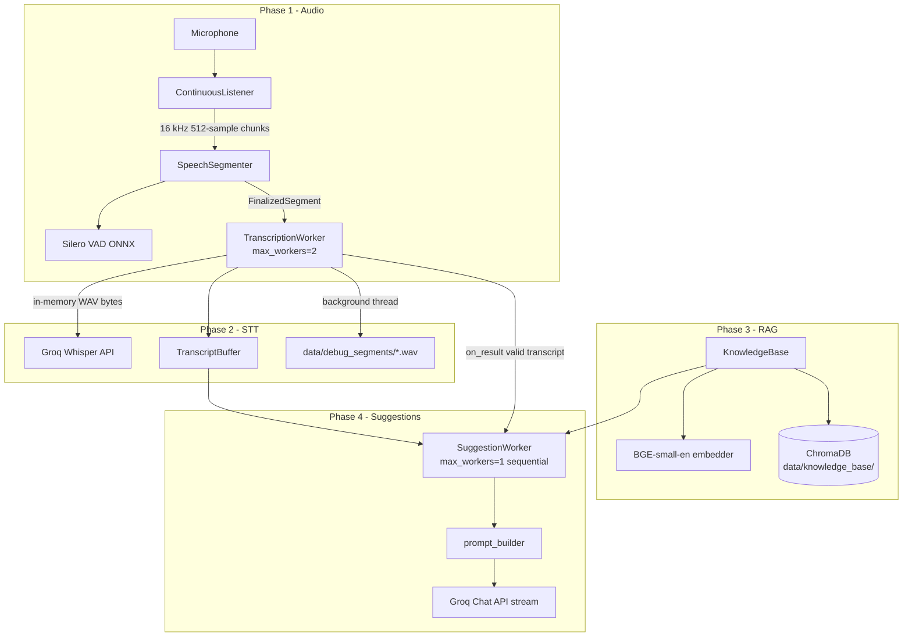

# Meeting Responder (Meeting Copilot)

Real-time meeting assistant that listens to live audio, detects speech segments, transcribes them via Groq Whisper, retrieves relevant facts from your own documents (RAG), and streams short reply suggestions you can say out loud during a call.

> **Maintaining this document:** Update this README whenever you add features, change defaults, swap models, or modify the pipeline. Keep configuration tables, phase status, and tuning values in sync with the code.

**Last updated:** 2026-06-29  
**Current status:** Phases 0–4 complete in dev scripts; PyQt6 UI is a stub (Phase 5 planned).

---

## Table of contents

1. [What it does](#what-it-does)
2. [Architecture & data flow](#architecture--data-flow)
3. [Development phases](#development-phases)
4. [Project structure](#project-structure)
5. [Requirements & setup](#requirements--setup)
6. [Configuration (`.env`)](#configuration-env)
7. [Models & local assets](#models--local-assets)
8. [External services](#external-services)
9. [Tuning parameters reference](#tuning-parameters-reference)
10. [Knowledge base (RAG)](#knowledge-base-rag)
11. [Prompt & suggestion behavior](#prompt--suggestion-behavior)
12. [Dev scripts](#dev-scripts)
13. [Testing](#testing)
14. [Observed latency (reference)](#observed-latency-reference)
15. [Known issues & limitations](#known-issues--limitations)
16. [Roadmap](#roadmap)

---

## What it does

| Capability | Description |
|------------|-------------|
| **Live capture** | Reads microphone at device-native sample rate (prefers 48 kHz), resamples to 16 kHz for VAD |
| **Voice activity detection** | Silero VAD (ONNX, local) splits speech into segments on silence pauses |
| **Speech-to-text** | Groq Whisper (`whisper-large-v3-turbo`) transcribes each segment asynchronously |
| **Document RAG** | Ingest PDF/DOCX/TXT → chunk → embed → ChromaDB; query at suggestion time |
| **Reply suggestions** | Groq LLM (`llama-3.3-70b-versatile`) streams 2–3 sentence replies grounded in retrieved docs |
| **Debug artifacts** | WAV segments saved to `data/debug_segments/`; retrieval scores printed in verbose mode |

The **production entry point for full pipeline testing** is `scripts/dev_assistant.py`.  
`scripts/dev_transcribe.py` is the STT-only baseline (intentionally unchanged when adding LLM features).

---

## Architecture & data flow

### End-to-end pipeline (`dev_assistant.py`)



### Segment lifecycle (timing)

1. **Speech starts** — VAD probability ≥ `0.5` AND peak level ≥ `0.04`
2. **Speech continues** — while speaking, VAD ≥ `0.35` (hysteresis) and level ≥ `0.04`
3. **Pause** — first silent chunk logged; after **900 ms** silence (`~29 chunks × 32 ms`), segment closes
4. **Finalize** — trailing silence trimmed; min duration **250 ms** or segment discarded
5. **STT** — in-memory encode (~0 ms) + Groq API (~0.3–0.6 s); debug WAV saved in parallel
6. **Suggestion** — embed query → retrieve chunks → stream LLM tokens (~0.2–0.8 s first token)

### Threading model

| Component | Pool | Workers | Why |
|-----------|------|---------|-----|
| `TranscriptionWorker` | `ThreadPoolExecutor` | **2** | STT can overlap with capture; segments may queue |
| `SuggestionWorker` | `ThreadPoolExecutor` | **1** | Sequential LLM streams avoid garbled interleaved terminal output |
| Debug WAV save | `threading.Thread` | daemon | Off critical STT path |

---

## Development phases

| Phase | Scope | Status | Entry point |
|-------|--------|--------|-------------|
| **0** | Scaffolding, deps, paths, tests | ✅ Done | `tests/run_all_tests.py` |
| **1** | Audio capture + Silero VAD segmentation | ✅ Done | `scripts/dev_listen.py` |
| **2** | Async Groq STT + latency tuning | ✅ Done | `scripts/dev_transcribe.py` |
| **3** | RAG ingest + vector query | ✅ Done | `scripts/dev_ingest.py`, `scripts/dev_query.py` |
| **4** | Streaming LLM suggestions + relevance filter | ✅ Done | `scripts/dev_assistant.py` |
| **5** | PyQt6 desktop UI | 🔲 Planned | `app/main.py` (stub window only) |

---

## Project structure

```
meeting_responder/
├── app/
│   ├── main.py                      # PyQt6 launcher (stub UI)
│   ├── assets/models/
│   │   └── silero_vad.onnx          # Silero VAD (~2.2 MB, not in git — add manually)
│   ├── core/
│   │   ├── groq_client.py           # Singleton Groq SDK client
│   │   ├── audio/
│   │   │   ├── capture.py           # Simple sd.rec test helper
│   │   │   ├── device_manager.py    # Mic listing & selection
│   │   │   ├── listener.py          # ContinuousListener + SpeechSegmenter
│   │   │   └── vad.py               # SileroVAD ONNX wrapper
│   │   ├── stt/
│   │   │   ├── groq_stt.py          # STT + warm_up + in-memory WAV encode
│   │   │   ├── transcription_worker.py
│   │   │   ├── transcript_buffer.py
│   │   │   └── transcript_quality.py
│   │   ├── rag/
│   │   │   ├── chunking.py          # Sentence-aware chunking
│   │   │   ├── embedder.py          # fastembed BGE-small-en
│   │   │   ├── ingestion.py         # PDF/DOCX parsers
│   │   │   ├── knowledge_base.py    # Ingest + query API
│   │   │   ├── vectorstore.py       # ChromaDB persistent store
│   │   │   └── chroma_telemetry.py  # No-op telemetry (silences Posthog noise)
│   │   └── llm/
│   │       ├── groq_llm.py          # ask_llm + streaming completions
│   │       ├── prompt_builder.py    # System/user messages for suggestions
│   │       └── suggestion_worker.py # RAG + LLM job runner
│   ├── ui/
│   │   ├── main_window.py           # Stub: "Environment OK"
│   │   └── styles/dark_theme.qss
│   └── utils/
│       ├── config.py                # pydantic-settings / .env
│       └── paths.py                 # DATA_DIR, KB_DIR, MODELS_DIR, etc.
├── data/
│   ├── knowledge_base/              # ChromaDB persistence (auto-created)
│   ├── debug_segments/              # Saved WAV segments (auto-created)
│   ├── test_acme_sla.txt            # Sample SLA doc for testing
│   └── test_office_locations.txt    # Sample office doc (unrelated topic)
├── scripts/
│   ├── dev_listen.py                # Phase 1 only
│   ├── dev_transcribe.py            # Phase 1 + 2 (STT baseline)
│   ├── dev_ingest.py                # Phase 3 ingest
│   ├── dev_query.py                 # Phase 3 query CLI
│   └── dev_assistant.py             # Phase 1–4 full pipeline
├── tests/                           # Dependency & smoke tests
├── .env                             # Secrets & model names (not committed)
├── requirements.txt
├── requirements-dev.txt
└── README.md                        # ← this file
```

---

## Requirements & setup

### Runtime

| Item | Value |
|------|--------|
| **Python** | **3.11** (venv uses 3.11.9). Do **not** use system Python 3.14 — several deps lack wheels. |
| **OS tested** | Windows 10/11 (PortAudio via `sounddevice`) |
| **Mic** | Any PortAudio input device; USB headset mic recommended over "Sound Mapper" |

### Install

```powershell
cd meeting_responder
python -m venv venv
venv\Scripts\python.exe -m pip install -r requirements.txt
```

Optional (packaging):

```powershell
venv\Scripts\python.exe -m pip install -r requirements-dev.txt
```

### VAD model

Download **Silero VAD ONNX** and place at:

```
app/assets/models/silero_vad.onnx
```

Expected size: **~2.22 MB**.

### Verify environment

```powershell
venv\Scripts\python.exe tests\run_all_tests.py
```

Expect **8 passed** (Groq tests skip if `GROQ_API_KEY` is empty).

---

## Configuration (`.env`)

Create `meeting_responder/.env`:

```env
GROQ_API_KEY=your_groq_api_key_here
GROQ_STT_MODEL=whisper-large-v3-turbo
GROQ_LLM_MODEL=llama-3.3-70b-versatile
```

| Variable | Default (in code) | Purpose |
|----------|-------------------|---------|
| `GROQ_API_KEY` | `""` (required for STT/LLM) | Groq API authentication |
| `GROQ_STT_MODEL` | `whisper-large-v3-turbo` | Whisper transcription model |
| `GROQ_LLM_MODEL` | `llama-3.3-70b-versatile` | Chat completion for suggestions |

Loaded via `pydantic-settings` from `app/utils/config.py` → `settings`.

**Never commit `.env` or API keys.**

---

## Models & local assets

### Local (on disk / first-run download)

| Model | Location / source | Size (approx.) | Used for |
|-------|-------------------|----------------|----------|
| **Silero VAD v4 ONNX** | `app/assets/models/silero_vad.onnx` | **~2.2 MB** | Speech vs silence per 32 ms chunk |
| **BAAI/bge-small-en-v1.5** | Downloaded by `fastembed` on first embed | **~130 MB** (ONNX cache) | 384-dim text embeddings for RAG |
| **ChromaDB index** | `data/knowledge_base/` | Grows with documents | Vector storage + HNSW search |

### Silero VAD details

| Parameter | Value |
|-----------|--------|
| Sample rate | **16 000 Hz** |
| Chunk size | **512 samples** (= **32 ms** per chunk) |
| Streaming context | **64 samples** prepended to each ONNX input |
| Recurrent state | `(2, 1, 128)` — call `reset_state()` each new session |
| Normalization | Peak-normalize to 0.95 if peak ≥ **0.05** |
| Runtime | `onnxruntime` CPUExecutionProvider |

### Embedding model details

| Parameter | Value |
|-----------|--------|
| Model ID | `BAAI/bge-small-en-v1.5` |
| Vector dimension | **384** |
| Library | `fastembed==0.3.6` |

---

## External services

All cloud inference goes through **[Groq](https://groq.com/)** (`groq==0.9.0`).

| Service | Model (default) | API surface | When called |
|---------|-----------------|-------------|-------------|
| **STT** | `whisper-large-v3-turbo` | `client.audio.transcriptions.create` | Each finalized speech segment |
| **LLM** | `llama-3.3-70b-versatile` | `client.chat.completions.create(stream=True)` | After each valid transcript (suggestion) |
| **Warm-up** | — | `client.models.list()` | Once at startup (`warm_up_groq_connection`) |

**Client reuse:** Single module-level singleton in `app/core/groq_client.py` — avoids repeated TLS handshakes.

**Network:** Requires outbound HTTPS to Groq. No other cloud APIs in the current pipeline.

---

## Tuning parameters reference

### Audio / VAD (`SpeechSegmenter` in `listener.py`)

| Parameter | Default | Location | Effect |
|-----------|---------|----------|--------|
| `DEFAULT_MIN_SILENCE_MS` | **900** | class constant | Pause length before segment closes. Lower = faster response; higher = fewer mid-sentence splits |
| `speech_start_threshold` | **0.5** | `__init__` | VAD prob to **enter** speaking state |
| `speech_continue_threshold` | **0.35** | `__init__` | VAD prob to **stay** in speaking (hysteresis) |
| `min_audio_level` | **0.04** | `__init__` | Peak amplitude noise gate — critical for pause detection |
| `min_speech_ms` | **250** | `__init__` | Segments shorter than this are discarded |

### Capture (`ContinuousListener`)

| Behavior | Value |
|----------|--------|
| Preferred native rate | **48000 Hz** (3:1 integer resample → 16 kHz) |
| Fallback rates tried | device default, **44100 Hz** |
| Output chunk queue | 512 samples @ 16 kHz |

### STT (`TranscriptionWorker` / `groq_stt.py`)

| Parameter | Default | Notes |
|-----------|---------|-------|
| `max_workers` | **2** | Parallel STT jobs |
| Audio path | In-memory `BytesIO` WAV | Disk save is async debug only |
| Warm-up | `models.list()` | Called before mic menu in dev scripts |

### RAG (`KnowledgeBase` / `SuggestionWorker`)

| Parameter | Default | Notes |
|-----------|---------|-------|
| `top_k` | **4** | Candidates fetched from Chroma |
| `relevance_threshold` | **0.55** | Score filter (see formula below) |
| `target_words` (chunking) | **300** | Per chunk target |
| `overlap_words` (chunking) | **40** | Sentence overlap between chunks |
| Recent transcript lines | **6** | Passed to prompt builder |

### Relevance score formula

Chroma returns **distance** (lower = closer). Converted in `knowledge_base.py`:

```
score = 1.0 / (1.0 + distance)    # higher = better match
```

Keep chunks where **`score >= relevance_threshold`**.

**Calibrated with 2 test docs** (2026-06-29):

| Query | SLA doc score | Office doc score | Passes @ 0.55 |
|-------|---------------|------------------|---------------|
| "SLA for critical incidents" | **0.68** | 0.48 | SLA only |
| "weather today" | 0.46 | 0.46 | **none** |
| "where is office located" | 0.50 | **0.63** | Office only |

### Transcript quality filter

`is_meaningful_transcript()` rejects empty, punctuation-only, or &lt; 2 alphanumeric characters.

---

## Knowledge base (RAG)

### Supported formats

| Extension | Parser |
|-----------|--------|
| `.txt` | UTF-8 read |
| `.pdf` | PyMuPDF (`fitz`) |
| `.docx` | `python-docx` |

### Ingest behavior

1. Parse full document text
2. `chunk_text()` — sentence split on `.` / `!` / `?` + greedy word budget
3. **Delete existing chunks** with same `source` filename (replace, not duplicate)
4. Embed chunks → store in Chroma collection `documents`

**Chunk metadata:** `{ source: filename, chunk_index: N }`  
**Chunk IDs:** `{filename}::{index}`

### Persistence

- Path: `data/knowledge_base/` (`KB_DIR` in `paths.py`)
- Survives restarts; shared across all scripts

### Test documents (included)

| File | Topic | Sample fact |
|------|-------|-------------|
| `data/test_acme_sla.txt` | SLA policy | Critical incidents resolved within **4 hours** |
| `data/test_office_locations.txt` | Office locations | HQ at **Building 12, Riverside Business Park** (March 2026) |

Ingest both before testing multi-doc retrieval:

```powershell
venv\Scripts\python.exe scripts\dev_ingest.py data\test_acme_sla.txt
venv\Scripts\python.exe scripts\dev_ingest.py data\test_office_locations.txt
venv\Scripts\python.exe scripts\dev_ingest.py --stats
```

---

## Prompt & suggestion behavior

### Design goals

1. Suggest **2–3 conversational sentences** the user can speak aloud
2. **Ground facts** only in retrieved document text
3. **Ignore irrelevant** retrieved snippets (LLM-side + threshold filter)
4. Respond to the **latest message**, not reopen earlier topics
5. **No hallucinated numbers/policies** when context is empty or unrelated

### Message structure (`prompt_builder.py`)

- **System prompt:** role, grounding rules, relevance judgment, anti-pivot instructions
- **User prompt:**
  - `Latest message (respond to this):` — most recent valid transcript line
  - `Earlier in the conversation:` — up to 5 prior lines (background only)
  - `Relevant context from documents:` — retrieved chunks with source + score, or "No relevant document context found."

### Debug retrieval output (`dev_assistant.py`, verbose mode)

Before each suggestion streams:

```
  [retrieved] score=0.68 source=test_acme_sla.txt
  [retrieved] score=0.48 source=test_office_locations.txt (below threshold)
```

Hidden when using `-q` / `--quiet`.

---

## Dev scripts

All scripts: run from repo root with venv Python.

```powershell
venv\Scripts\python.exe scripts\<script>.py [args]
```

Common flags for listen/transcribe/assistant scripts:

| Flag | Description |
|------|-------------|
| `-l` / `--list` | List input devices and exit |
| `-d N` / `N` | PortAudio device index (skip interactive menu) |
| `-q` / `--quiet` | Hide live VAD status lines |

> **Note:** Interactive menu number ≠ PortAudio index. Use the `[N]` value from `--list`.

### `dev_listen.py` — Phase 1

VAD segmentation only; prints segment durations; saves WAVs. No STT or LLM.

### `dev_transcribe.py` — Phase 1 + 2

Live capture + async Groq STT. Prints latency breakdown:

```
[Segment #1] ("2.1s audio", encode: 0.00s, api: 0.35s, total: 0.95s) → "Hello."
```

### `dev_ingest.py` — Phase 3

```powershell
venv\Scripts\python.exe scripts\dev_ingest.py path\to\file.pdf
venv\Scripts\python.exe scripts\dev_ingest.py --stats
venv\Scripts\python.exe scripts\dev_ingest.py --clear   # asks y/N
```

### `dev_query.py` — Phase 3

```powershell
venv\Scripts\python.exe scripts\dev_query.py "what is the SLA for critical incidents"
venv\Scripts\python.exe scripts\dev_query.py              # prompts for query
venv\Scripts\python.exe scripts\dev_query.py -k 4 "..."   # top-k (default 4)
```

### `dev_assistant.py` — Phase 1–4 (full pipeline)

```powershell
venv\Scripts\python.exe scripts\dev_assistant.py -d 1
```

Startup prints KB stats, warms Groq connection, then listens. On each valid transcript:

1. Print STT result with timing
2. Print `[retrieved]` score lines (verbose)
3. Stream `[Segment #N suggestion]: ...`
4. Print `(retrieved N chunks · first token: Xs · total: Xs)`

**Suggested manual test (3 phrases, ~1 s pause between each):**

| # | Say | Expected |
|---|-----|----------|
| A | "What's your SLA for critical incidents?" | Retrieves SLA doc; cites **4 hours** |
| B | "What do you think about the weather today?" | No SLA/office facts; generic weather reply |
| C | "Where is your office located?" | Retrieves office doc; cites **Building 12** |

### `app/main.py` — UI stub

```powershell
venv\Scripts\python.exe -m app.main
```

Shows PyQt6 window with "Environment OK" — not wired to the pipeline yet.

---

## Testing

### Automated suite

```powershell
venv\Scripts\python.exe tests\run_all_tests.py
```

| Test | What it checks |
|------|----------------|
| `pyqt` | MainWindow creates |
| `audio_devices` | PortAudio input enumeration |
| `doc_parsing` | PDF + DOCX text extraction |
| `embeddings` | fastembed produces 384-dim vectors |
| `vectorstore` | Chroma add + query round-trip |
| `vad` | Silero probability on silence ≈ 0 |
| `groq_llm` | Groq chat API (needs API key) |
| `groq_stt` | Groq transcription API (needs API key) |

Individual tests: `venv\Scripts\python.exe tests\test_vad.py`, etc.

---

## Observed latency (reference)

Typical on a wired connection with warm-up (your results may vary):

| Stage | First segment | Subsequent segments |
|-------|---------------|---------------------|
| Silence wait | **900 ms** (tunable) | 900 ms |
| STT encode | ~**0.00 s** | ~0.00 s |
| STT Groq API | ~**0.3–0.6 s** | ~0.3–0.4 s |
| STT total | ~**1.0–1.5 s** after pause | ~1.0 s |
| LLM first token | ~**0.2–0.8 s** | ~0.2–0.5 s |
| LLM total suggestion | ~**0.3–1.2 s** | ~0.3–0.8 s |

Cold-start STT without warm-up was ~**3+ s** before singleton client + `warm_up_groq_connection()` were added.

---

## Known issues & limitations

| Issue | Severity | Notes |
|-------|----------|-------|
| **Single-doc KB bias** | Mitigated | With one document, every query matches something; use ≥2 docs + threshold **0.55** |
| **Re-ingest Chroma warning** | Cosmetic | `"Add of existing embedding ID"` may log on re-ingest; chunk count stays correct — delete-before-add works |
| **Sound Mapper on Windows** | UX | Prefer direct USB mic index over Microsoft Sound Mapper |
| **PyQt6 UI** | Planned | Pipeline only exposed via terminal dev scripts today |
| **No speaker diarization** | By design | Assumes one speaker per segment; no "who said what" |
| **English-oriented** | Partial | Whisper handles multiple languages; embedder is English (`bge-small-en`) |
| **Internet required** | Required | STT + LLM are cloud-only on Groq |

---

## Roadmap

- [ ] **Phase 5:** PyQt6 UI — separate transcript + suggestion panels, device picker, KB manager
- [ ] Optional local LLM / STT fallback
- [ ] Configurable relevance threshold via `.env` or UI
- [ ] Virtual audio cable support (e.g. capture meeting tab audio)

---

## Dependency pins (`requirements.txt`)

| Package | Version | Role |
|---------|---------|------|
| PyQt6 | 6.7.1 | Desktop UI (stub) |
| sounddevice | 0.4.6 | PortAudio mic capture |
| soundfile | 0.12.1 | WAV read/write |
| numpy | 1.26.4 | Audio arrays |
| onnxruntime | 1.18.1 | Silero VAD inference |
| groq | 0.9.0 | Groq API client |
| fastembed | 0.3.6 | Local embedding model |
| chromadb | 0.5.5 | Vector database |
| PyMuPDF | 1.24.7 | PDF parsing |
| python-docx | 1.1.2 | DOCX parsing |
| pydantic-settings | 2.3.4 | `.env` configuration |

---

## Quick start (full pipeline)

```powershell
cd meeting_responder
venv\Scripts\python.exe -m pip install -r requirements.txt

# 1. Add GROQ_API_KEY to .env
# 2. Place silero_vad.onnx in app/assets/models/

venv\Scripts\python.exe tests\run_all_tests.py
venv\Scripts\python.exe scripts\dev_ingest.py data\test_acme_sla.txt
venv\Scripts\python.exe scripts\dev_ingest.py data\test_office_locations.txt
venv\Scripts\python.exe scripts\dev_assistant.py --list
venv\Scripts\python.exe scripts\dev_assistant.py -d 1
```

Press **Ctrl+C** to stop; summary prints segments, transcripts, and suggestion counts.
